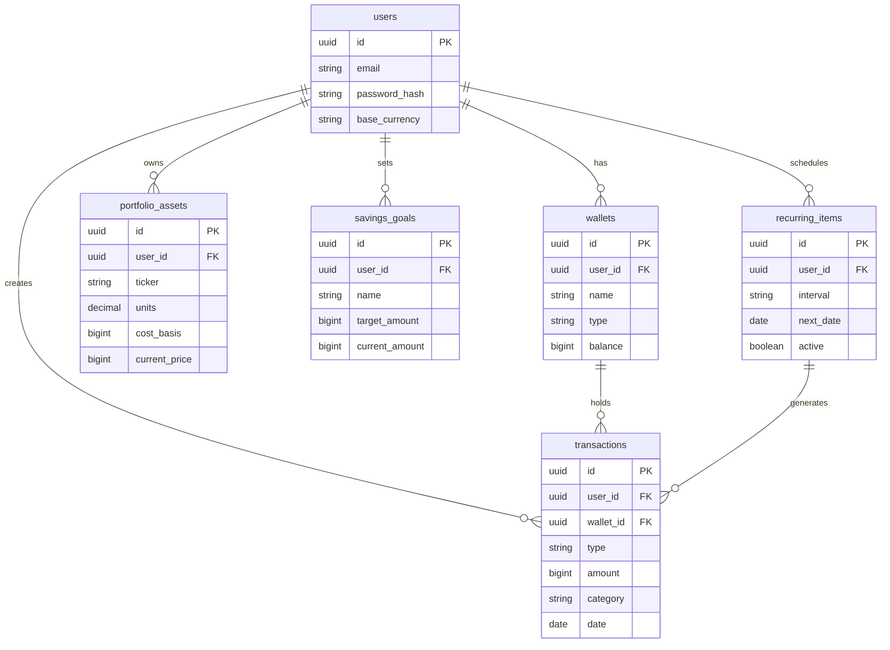

# 🏗️ Backend Architecture Plan — Finance Watcher

> Based on the current Frontend analysis (types, context, constants), this document proposes a suitable Backend architecture to migrate data from `localStorage` to a real server system.

---

## 1. Proposed Tech Stack

| Layer | Technology | Reason for choice |
|---|---|---|
| **Runtime** | Node.js (v20+) | Monorepo already uses JS/TS entirely |
| **Framework** | **NestJS** | TypeScript-first, good modularity, built-in decorators |
| **Database** | **PostgreSQL** | Clear relations, JSONB support, strong for aggregation |
| **ORM** | **Prisma** | Type-safe, auto-migration, visual schema |
| **Auth** | **JWT (Access + Refresh token)** | Stateless, suitable for SPAs |
| **Validation** | `class-validator` + `class-transformer` | Built-in NestJS integration |
| **API Style** | **REST** (can add tRPC later) | Simple, easy to test with Postman |
| **Cache** | Redis (optional) | Cache foreign exchange rates |

> **Why not GraphQL?** The app has a clear resource structure, REST is sufficient and easier to debug in the early stages.

---

## 2. Database Schema (ERD)

### 2.1 `users` Table
```sql
users
├── id            UUID PRIMARY KEY DEFAULT gen_random_uuid()
├── email         VARCHAR(255) UNIQUE NOT NULL
├── password_hash VARCHAR(255) NOT NULL
├── display_name  VARCHAR(100)
├── base_currency VARCHAR(10) DEFAULT 'VND'   -- 'VND' | 'USD' | 'MYR'
├── created_at    TIMESTAMPTZ DEFAULT now()
└── updated_at    TIMESTAMPTZ DEFAULT now()
```

### 2.2 `wallets` Table *(Frontend currently has Wallet but not persisted)*
```sql
wallets
├── id            UUID PRIMARY KEY
├── user_id       UUID REFERENCES users(id) ON DELETE CASCADE
├── name          VARCHAR(100) NOT NULL         -- "Cash", "Chase Bank", "PayPal"...
├── type          VARCHAR(50)                   -- 'cash' | 'bank' | 'e-wallet' | 'credit'
├── balance       BIGINT DEFAULT 0              -- in base currency (VND), stored as integer (avoid float)
├── currency      VARCHAR(10) DEFAULT 'VND'
├── color         VARCHAR(20)
├── icon          VARCHAR(50)
├── created_at    TIMESTAMPTZ DEFAULT now()
└── updated_at    TIMESTAMPTZ DEFAULT now()
```

> ⚠️ **Store money as `BIGINT` (smallest unit of currency)** to avoid floating-point errors. For VND → store whole dong. For USD → store cents.

### 2.3 `transactions` Table *(Core entity)*
```sql
transactions
├── id                UUID PRIMARY KEY
├── user_id           UUID REFERENCES users(id) ON DELETE CASCADE
├── wallet_id         UUID REFERENCES wallets(id) ON DELETE SET NULL
├── type              VARCHAR(20) NOT NULL      -- 'income' | 'expense' | 'saving' | 'investment'
├── amount            BIGINT NOT NULL           -- stored in base currency
├── original_amount   BIGINT NOT NULL
├── original_currency VARCHAR(10) NOT NULL
├── category          VARCHAR(100) NOT NULL
├── sub_category      VARCHAR(100)
├── date              DATE NOT NULL
├── notes             TEXT
├── recurring_id      UUID REFERENCES recurring_items(id) ON DELETE SET NULL
├── created_at        TIMESTAMPTZ DEFAULT now()
└── updated_at        TIMESTAMPTZ DEFAULT now()

-- Indexes for common queries:
CREATE INDEX idx_transactions_user_date ON transactions(user_id, date DESC);
CREATE INDEX idx_transactions_user_type ON transactions(user_id, type);
```

### 2.4 `portfolio_assets` Table
```sql
portfolio_assets
├── id             UUID PRIMARY KEY
├── user_id        UUID REFERENCES users(id) ON DELETE CASCADE
├── name           VARCHAR(200) NOT NULL        -- "Apple", "Bitcoin"
├── ticker         VARCHAR(50)                  -- "AAPL", "BTC"
├── asset_type     VARCHAR(50)                  -- 'stock' | 'crypto' | 'real_estate' | 'gold'
├── units          DECIMAL(18, 8) NOT NULL       -- supports crypto (many decimal places)
├── cost_basis     BIGINT NOT NULL              -- per unit, in base currency
├── current_price  BIGINT NOT NULL              -- per unit, in base currency
├── currency       VARCHAR(10) NOT NULL
├── purchase_date  DATE
├── notes          TEXT
├── created_at     TIMESTAMPTZ DEFAULT now()
└── updated_at     TIMESTAMPTZ DEFAULT now()
```

### 2.5 `savings_goals` Table
```sql
savings_goals
├── id              UUID PRIMARY KEY
├── user_id         UUID REFERENCES users(id) ON DELETE CASCADE
├── name            VARCHAR(200) NOT NULL
├── target_amount   BIGINT NOT NULL
├── current_amount  BIGINT DEFAULT 0
├── deadline        DATE
├── color           VARCHAR(20)
├── icon            VARCHAR(50)
├── status          VARCHAR(20) DEFAULT 'active'  -- 'active' | 'completed' | 'paused'
├── created_at      TIMESTAMPTZ DEFAULT now()
└── updated_at      TIMESTAMPTZ DEFAULT now()
```

### 2.6 `recurring_items` Table
```sql
recurring_items
├── id                UUID PRIMARY KEY
├── user_id           UUID REFERENCES users(id) ON DELETE CASCADE
├── type              VARCHAR(20) NOT NULL
├── amount            BIGINT NOT NULL
├── original_currency VARCHAR(10) NOT NULL
├── category          VARCHAR(100) NOT NULL
├── sub_category      VARCHAR(100)
├── interval          VARCHAR(20) NOT NULL       -- 'daily' | 'weekly' | 'monthly' | 'yearly'
├── next_date         DATE NOT NULL
├── notes             TEXT
├── active            BOOLEAN DEFAULT true
├── created_at        TIMESTAMPTZ DEFAULT now()
└── updated_at        TIMESTAMPTZ DEFAULT now()
```

### 2.7 `categories` Table *(optional — seed data)*
```sql
categories
├── id          UUID PRIMARY KEY
├── type        VARCHAR(20) NOT NULL   -- 'income' | 'expense' | 'saving' | 'investment'
├── label       VARCHAR(100) NOT NULL
├── color       VARCHAR(20)
├── is_system   BOOLEAN DEFAULT true   -- system category vs user-defined
└── parent_id   UUID REFERENCES categories(id)  -- null = top-level, else = sub-category
```

---

## 3. ERD Diagram



---

## 4. REST API Design

### Base URL: `/api/v1`

### 4.1 Auth
| Method | Endpoint | Description |
|--------|----------|-------|
| `POST` | `/auth/register` | Register an account |
| `POST` | `/auth/login` | Login → returns `access_token` + `refresh_token` |
| `POST` | `/auth/refresh` | Refresh access token |
| `POST` | `/auth/logout` | Invalidate refresh token |
| `GET`  | `/auth/me` | Get current user info |

### 4.2 Wallets
| Method | Endpoint | Description |
|--------|----------|-------|
| `GET`    | `/wallets` | List wallets |
| `POST`   | `/wallets` | Create a new wallet |
| `GET`    | `/wallets/:id` | Wallet details |
| `PATCH`  | `/wallets/:id` | Update a wallet |
| `DELETE` | `/wallets/:id` | Delete a wallet |

### 4.3 Transactions
| Method | Endpoint | Description |
|--------|----------|-------|
| `GET`    | `/transactions` | List (filter: type, date, category, walletId) |
| `POST`   | `/transactions` | Create a transaction |
| `GET`    | `/transactions/:id` | Details |
| `PATCH`  | `/transactions/:id` | Update |
| `DELETE` | `/transactions/:id` | Delete |
| `GET`    | `/transactions/summary` | Monthly summary (income/expense/saving) |

**Query params for GET /transactions:**
```
?page=1&limit=20
&type=expense
&startDate=2026-01-01&endDate=2026-03-31
&category=Food
&walletId=<uuid>
&sortBy=date&sortOrder=desc
```

### 4.4 Portfolio Assets
| Method | Endpoint | Description |
|--------|----------|-------|
| `GET`    | `/portfolio` | Entire investment portfolio |
| `POST`   | `/portfolio` | Add asset |
| `PATCH`  | `/portfolio/:id` | Update (price, units) |
| `DELETE` | `/portfolio/:id` | Delete asset |
| `GET`    | `/portfolio/summary` | PnL, total value, % profit/loss |

### 4.5 Savings Goals
| Method | Endpoint | Description |
|--------|----------|-------|
| `GET`    | `/goals` | List goals |
| `POST`   | `/goals` | Create goal |
| `PATCH`  | `/goals/:id` | Update (add money, rename...) |
| `DELETE` | `/goals/:id` | Delete goal |

### 4.6 Recurring Items
| Method | Endpoint | Description |
|--------|----------|-------|
| `GET`    | `/recurring` | List items |
| `POST`   | `/recurring` | Create new |
| `PATCH`  | `/recurring/:id` | Update / toggle on-off |
| `DELETE` | `/recurring/:id` | Delete |

### 4.7 Dashboard & Analytics
| Method | Endpoint | Description |
|--------|----------|-------|
| `GET` | `/analytics/dashboard` | Overview cards (income, expense, totalAssets...) |
| `GET` | `/analytics/net-worth` | Net worth history by month |
| `GET` | `/analytics/spending` | Spending by category (used for pie chart) |

---

## 5. Authentication Flow

```
Client                          Server
  │                                │
  ├─ POST /auth/login ────────────►│
  │   { email, password }          │  Validate → bcrypt.compare
  │                                │
  │◄── { access_token (15m),  ─────┤
  │      refresh_token (7d) }      │  Save refresh_token hash to DB
  │                                │
  ├─ GET /transactions ───────────►│
  │   Authorization: Bearer <AT>   │  Verify JWT → inject user into request
  │                                │
  ├─ POST /auth/refresh ──────────►│
  │   { refresh_token }            │  Verify RT → issue new AT
  │◄── { access_token } ───────────┤
```

---

## 6. NestJS Module Structure

```
apps/api/src/
├── main.ts
├── app.module.ts
├── prisma/
│   ├── schema.prisma          ← Prisma schema (source of truth)
│   └── prisma.service.ts
├── auth/
│   ├── auth.module.ts
│   ├── auth.controller.ts
│   ├── auth.service.ts
│   ├── jwt.strategy.ts
│   └── dto/
├── users/
│   └── users.service.ts
├── wallets/
│   ├── wallets.controller.ts
│   ├── wallets.service.ts
│   └── dto/
├── transactions/
│   ├── transactions.controller.ts
│   ├── transactions.service.ts
│   └── dto/
├── portfolio/
├── goals/
├── recurring/
└── analytics/
    ├── analytics.controller.ts
    └── analytics.service.ts
```

---

## 7. Migration Roadmap from localStorage

| Phase | Content |
|-------|---------|
| **Phase 1** | Setup NestJS + Prisma + PostgreSQL, implement Auth |
| **Phase 2** | CRUD APIs: Wallets, Transactions, Goals, Portfolio, Recurring |
| **Phase 3** | Analytics endpoints (dashboard summary, net worth history) |
| **Phase 4** | Frontend migration: replace `localStorage` with API calls + React Query |
| **Phase 5** | Cron job to automatically create transactions from `recurring_items` |

---

## 8. Key Decisions Needed

> [!IMPORTANT]
> **Store monetary amounts as BIGINT or DECIMAL?**  
> Recommendation: BIGINT (store the smallest unit, e.g., for VND store whole numbers, for USD store cents).  
> Reason: Avoid floating-point errors. Frontend handles division/multiplication multipliers when displaying.

> [!IMPORTANT]  
> **Multi-user or Single-user?**  
> Recommendation: Design for Multi-user from the start (every table has `user_id`). It simplifies things later even if only used by 1 user initially.

> [!NOTE]
> **Real-time prices for Portfolio?**  
> Could integrate an external API (CoinGecko/Yahoo Finance) and cache with Redis. This is Phase 5+.
